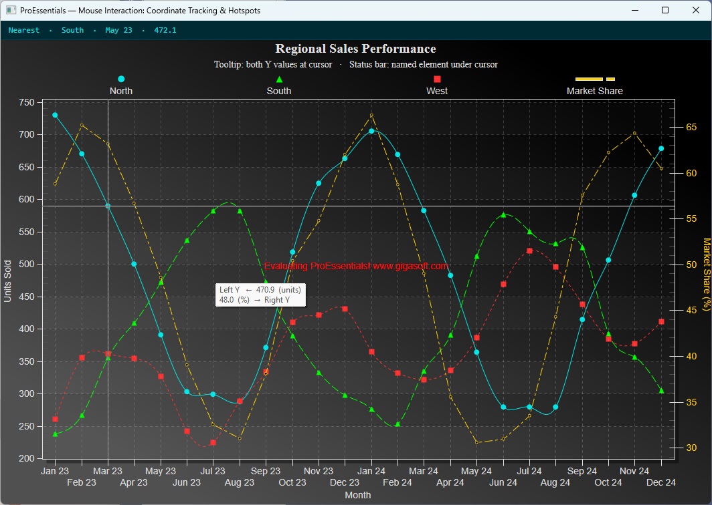

# ProEssentials WPF — Mouse Interaction: Coordinate Tracking & Hotspots

A ProEssentials v10 WPF .NET 8 demonstration of two complementary
mouse-interaction techniques shown together in a single `PegoWpf`
dual-Y-axis chart.



➡️ [gigasoft.com/examples](https://gigasoft.com/examples)

---

## What This Demonstrates

| Technique | API Surface | Best For |
|-----------|-------------|----------|
| **Tooltip — both Y values at cursor** | `ConvPixelToGraph` + `PeCustomTrackingDataText` | Reading interpolated values at any position, between data points |
| **Status bar — named element under cursor** | `GetHotSpot` + `SearchSubsetPointIndex` | Identifying chart elements by name, driving click actions |

Both techniques run simultaneously from the same chart. Move the mouse to see them work together.

---

## ProEssentials Features Demonstrated

### Dual Y-Axis (Right Y)

The last subset is assigned to the right Y axis via `RYAxisComparisonSubsets`:

```csharp
Pego1.PePlot.RYAxisComparisonSubsets = 1;   // last 1 subset → right Y
Pego1.PePlot.Method                  = GraphPlottingMethod.PointsPlusSpline;
Pego1.PePlot.MethodII                = GraphPlottingMethodII.Line; // right Y style

Pego1.PeString.YAxisLabel  = "Units Sold";
Pego1.PeString.RYAxisLabel = "Market Share (%)";
Pego1.PeColor.RYAxis       = GoldColor;  // sync axis color to subset color
```

---

### Technique 1 — ConvPixelToGraph Tooltip (Example 007)

`ConvPixelToGraph` converts mouse pixel coordinates to data-unit coordinates.
Called twice — once per Y axis — to read both scales at the cursor position:

```csharp
private void Pego1_PeCustomTrackingDataText(object sender,
    Gigasoft.ProEssentials.EventArg.CustomTrackingDataTextEventArgs e)
{
    System.Drawing.Point pt = Pego1.PeUserInterface.Cursor.LastMouseMove;
    System.Drawing.Rectangle r = Pego1.PeFunction.GetRectGraph();
    if (!r.Contains(pt)) return;

    int nA = 0, nX = pt.X, nY = pt.Y;
    double fX = 0, fLY = 0, fRY = 0;

    // Left Y axis
    Pego1.PeFunction.ConvPixelToGraph(ref nA, ref nX, ref nY, ref fX, ref fLY,
                                       false, false, false);
    // Right Y axis — reset coords then call again with rightAxis = true
    nX = pt.X; nY = pt.Y; nA = 0;
    Pego1.PeFunction.ConvPixelToGraph(ref nA, ref nX, ref nY, ref fX, ref fRY,
                                       true, false, false);

    e.TrackingText = $"Left Y  ←  {fLY:0.0}  (units)\n{fRY:0.0}  (%)  →  Right Y";
}
```

**Key points:**
- `TrackingCustomDataText = true` activates the event
- `e.TrackingText` replaces the default tooltip string
- Works continuously between data points — values are interpolated
- `TrackingPromptTrigger == CursorMove` means a keyboard arrow key moved
  the cursor to a snapped data point — read `PeData.Y` directly instead

---

### Technique 2 — GetHotSpot Status Bar (Example 014)

`GetHotSpot()` returns the named chart element under the current mouse
position. The `MouseMove` handler updates the status `TextBlock`:

```csharp
private void Pego1_MouseMove(object sender, MouseEventArgs e)
{
    Gigasoft.ProEssentials.Structs.HotSpotData ds = Pego1.PeFunction.GetHotSpot();

    if (ds.Type == HotSpotType.DataPoint)
    {
        // ds.Data1 = subset index, ds.Data2 = point index
        float val = Pego1.PeData.Y[ds.Data1, ds.Data2];
        StatusText.Text = $"Data point  ·  {Pego1.PeString.SubsetLabels[ds.Data1]}"
                        + $"  ·  {Pego1.PeString.PointLabels[ds.Data2]}  ·  {val:0.0}";
    }
    else if (ds.Type == HotSpotType.Subset)
        StatusText.Text = $"Series legend  ·  {Pego1.PeString.SubsetLabels[ds.Data1]}";
    else if (ds.Type == HotSpotType.Point)
        StatusText.Text = $"Point label  ·  {Pego1.PeString.PointLabels[ds.Data1]}";
    else
    {
        // Not over a named element — find nearest data point
        System.Drawing.Point pt = Pego1.PeUserInterface.Cursor.LastMouseMove;
        int nResult = Pego1.PeFunction.SearchSubsetPointIndex(pt.X, pt.Y);
        if (nResult != 0)
        {
            int s = Pego1.PeFunction.ClosestSubsetIndex;
            int p = Pego1.PeFunction.ClosestPointIndex;
            StatusText.Text = $"Nearest  ·  {Pego1.PeString.SubsetLabels[s]}"
                            + $"  ·  {Pego1.PeString.PointLabels[p]}"
                            + $"  ·  {Pego1.PeData.Y[s, p]:0.0}";
        }
    }
}
```

**HotSpotData struct fields:**
| Field | Meaning |
|-------|---------|
| `ds.Type` | `HotSpotType` enum — `DataPoint`, `Subset`, `Point`, `None`, ... |
| `ds.Data1` | Subset index for `DataPoint`/`Subset`; point index for `Point` |
| `ds.Data2` | Point index for `DataPoint` |

**Enable hotspot hit testing:**
```csharp
Pego1.PeUserInterface.HotSpot.Data   = true;  // data points
Pego1.PeUserInterface.HotSpot.Subset  = true;  // series legends
Pego1.PeUserInterface.HotSpot.Point   = true;  // X-axis labels
Pego1.PeUserInterface.HotSpot.Size    = HotSpotSize.Large;
```

---

### Cursor Snap

```csharp
Pego1.PeUserInterface.Cursor.Mode                         = CursorMode.DataCross;
Pego1.PeUserInterface.Cursor.MouseCursorControl            = true;
Pego1.PeUserInterface.Cursor.MouseCursorControlClosestPoint = true;
```

`MouseCursorControlClosestPoint = true` makes the crosshair cursor snap to
the nearest data point as the mouse moves, without requiring a click.

---

## Data

4 subsets × 24 monthly points (Jan 2023 – Dec 2024) of synthetic regional
sales data:

| Subset | Series | Axis | Color |
|--------|--------|------|-------|
| 0 | North | Left Y (units) | Cyan |
| 1 | South | Left Y (units) | Green |
| 2 | West  | Left Y (units) | Red |
| 3 | Market Share | Right Y (%) | Gold |

---

## Controls

| Input | Action |
|-------|--------|
| Mouse move | Status bar identifies element under cursor |
| Mouse hover | Tooltip shows both Y-axis values at cursor |
| Left-click drag | Zoom box |
| Right-click | Context menu — export, print, customize |

---

## Prerequisites

- Visual Studio 2022
- .NET 8 SDK

---

## How to Run

```
1. Clone this repository
2. Open MouseInteractionHotspots.sln in Visual Studio 2022
3. Build → Rebuild Solution (NuGet restore is automatic)
4. Press F5
```

---

## NuGet Package

References
[`ProEssentials.Chart.Net80.x64.Wpf`](https://www.nuget.org/packages/ProEssentials.Chart.Net80.x64.Wpf).
Package restore is automatic on build.

---

## Related Examples

- [WPF Custom Y-Axis Labeling](https://github.com/GigasoftInc/wpf-chart-custom-yaxis-labels-annotations-events-proessentials)
- [WPF Heatmap Spectrogram](https://github.com/GigasoftInc/wpf-chart-heatmap-spectrogram-proessentials)
- [All Examples — GigasoftInc on GitHub](https://github.com/GigasoftInc)
- [Full Evaluation Download](https://gigasoft.com/net-chart-component-wpf-winforms-download)
- [gigasoft.com](https://gigasoft.com)

---

## License

Example code is MIT licensed. ProEssentials requires a commercial
license for continued use.
